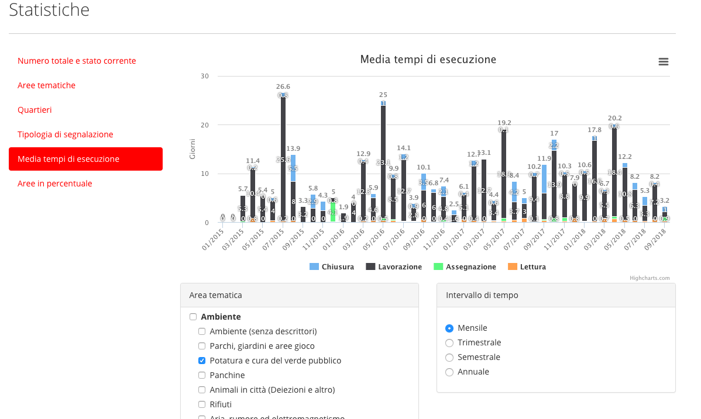

.. _h6e346c2f75b1a676653466f377a121b:

Piattaforma OpenPA
******************

La piattaforma OpenPA, è utilizzata in oltre 200 enti locali e società pubbliche, la maggior parte in Trentino. Si tratta di una suite molto flessibile, esito di un’intensa attività di co-progettazione con diversi enti pubblici, che permette di ripensare le modalità di comunicazione con i cittadini in una chiave innovativa, trasparente e moderna. 

La piattaforma dispone di una serie di moduli indipendenti tra loro, ma interoperabili, chiamati anche “micro-servizi”\ [#F1]_\ , che vengono forniti in modalità As A Service (SaaS) e che possono xessere attivati in tempi diversi a seconda delle priorità o delle necessità organizzative dell’ente che li adotta; i moduli su cui OpenContent ha maggiormente investito in questi anni sono finalizzati in particolare a migliorare l’interazione tra cittadini (associazioni, imprese, famiglie), dipendenti (funzionari, dirigenti) ed amministratori locali (parte politica); in taluni casi, come per la Stanza del Cittadino o OpenSegnalazioni, i micro-servizi sono pensati per coinvolgere anche più enti nel dialogo con il cittadino (ad esempio, nei contesti di gestione associata dei servizi o unioni di comuni). 

.. _h5c1e586a5c30103f764e51385b785135:

Dati e classi di contenuti
==========================

La progettazione della piattaforma OpenPA e dei micro-servizi è stata fortemente orientata alla strutturazione dei dati. Questo rende più semplice la gestione e la diffusione multicanale delle informazioni, oltre a consentire l’apertura dei dati raccolti nella piattaforma stessa (Open Data). Alcune iniziative progettuali hanno favorito il costante perfezionamento del modello dati sotteso, avvicinandolo sempre più a quello di un’ontologia formale; tra queste:

* sviluppo di un pilot nel contesto di ISA², con Provincia autonoma di Trento e Consorzio dei Comuni Trentini, finalizzato a sviluppare l’interoperabilità semantica a livello europeo (vedi: \ |LINK1|\   e \ |LINK2|\  ); in questo contesto è stata perfezionata la struttura di alcune classi informative secondo i requisiti dei “Core Vocabularies”

* Tavolo di lavoro provinciale (Trentino) sulle “classi informative”, in collaborazione con PAT e gli enti locali del Trentino, in cui è stato messo a punto un sistema di allineamento delle classi ad un modello centrale; questo consente di mantenere costantemente allineata la strutturazione delle informazioni su centinaia di siti web
* 
* \ |IMG1|\ 

* tavolo di lavoro europeo, insieme ai referenti di AgID impegnati nello sviluppo dell’ontologia nazionale (OntoPiA), per la definizione del nuovo Core Vocabularies dedicato agli eventi culturali (CPEV-AP) e relativo profilo italiana (CPEV-AP_IT); vedi: \ |LINK3|\  

* Documentazione sulle classi di contenuto, avviata qui: \ |LINK4|\  

* Sviluppo di un sistema di pubblicazione automatica di circa 5.000 dataset, generati automaticamente dalla piattaforma OpenPA, sul catalogo degli Open Data del Trentino: \ |LINK5|\  

I dati raccolti possono essere scambiati automaticamente tra i microservizi (dove possibile, attraverso un sistema di API pubbliche - vedi componente OpenDati), in modo da evitare problematiche di duplicazione delle informazioni. Per fare un esempio: l’organizzazione della struttura comunale, che viene strutturata nel sito web istituzionale dell’ente (microservizio: OpenCity) viene usata dal workflow di gestione delle segnalazioni aperte dai cittadini (microservizio: OpenSegnalazioni); dunque, quando cambia il ruolo di un operatore nel sito, questo dato viene automaticamente aggiornato anche all’interno del sistema di gestione delle segnalazioni.

Le caratteristiche tecniche del sistema su cui è basato OpenPA rendono la piattaforma compatibile con le indicazioni riconosciute in merito di SEO, ad esempio la gestione delle nice urls, ma anche la possibilità di ottimizzare i metadati esposti da ogni singola tipologia di contenuto.

.. _h1f551f5e5163797f4c5a5c1560756e41:

Favorire il processo di trasformazione digitale e la diffusione delle competenze nella PA
-----------------------------------------------------------------------------------------

La progettazione e lo sviluppo di nuovi micro-servizi legati ad OpenPA si prefiggono di raggiungere un obiettivo molto chiaro: quello di accompagnare gli enti verso un graduale processo di trasformazione digitale, in totale sinergia con lo spirito del Piano Triennale per l’Informatica della PA e con le metodologie suggerite da Team Digitale e AgID nel corso degli ultimi anni. Ciascun microservizio ha il compito di nascondere la complessità di processi e rispetto rigoroso delle normative, cercando di risolvere automaticamente questo tipo di problematiche all’interno di ambiti molto specifici (es. Gestione partecipata degli eventi culturali). Il trasferimento di competenze al personale amministrativo ha l’obiettivo di agire in termini di capacity building sulle strutture organizzative coinvolte, responsabilizzando ogni singolo funzionario nel processo di comunicazione; ne è un esempio il modello di redazione diffusa dei contenuti, illustrato brevemente nella descrizione del microservizio OpenUfficioStampa.

.. _h78579265815687e4c2449585a7b7e4a:

Componenti software attivabili
==============================

.. _h7c73379766091e4f6f306d7b47742d:

OpenDati
--------

E’ un microservizio che permette di esportare tutte le tipologie di dati contenute nella piattaforma OpenPA, per produrre Open Data ed esporre, attraverso un sistema di API, informazioni strutturate che possono essere riutilizzate da terze parti (API economy); tali API vengono già utilizzate da sistemi terzi per la realizzazione di servizi esterni a OpenPA (es. Chatbot, App e applicazioni web).

Caso studio: cruscotto “Data Comunweb”, nato per la necessità di verificare la frequenza con cui i comuni del Trentino aggiornano il proprio sito e per intercettare i principali problemi, errori ed incompletezze:

\ |LINK6|\  (scorrere verso il basso per visualizzare i dati)

.. _h2a2119404b211b3224611de53315f17:

OpenMonitor
-----------

Si tratta di un componente che si occupa di gestire la rappresentazione grafica dei dati inseriti nel piattaforma OpenPA. In base agli indicatori (KPI) concordati con l’ente, è possibile mostrare grafici interattivi che, in combinazione con filtri di ricerca, consentono a cittadini, dirigenti ed amministratori di comprendere rapidamente l’andamento di alcune situazioni e di comprenderne le ragioni, verificandone gli aspetti di dettaglio.

Esempio di grafici pubblici: \ |LINK7|\  

Esempio di grafici riservati: performance dell’attività di “potatura e cura del verde pubblico” (vedi immagine sottostante)

\ |IMG2|\ 

.. _h4542797c211fc405e76234175702463:

OC-GDPR
-------

E’ un modulo che consente di gestire la raccolta del consenso informato per ognuno dei punti che prevedono un inserimento di dati sensibili da parte dell’utente (form di registrazione e di contatto), nel rispetto del  regolamento europeo UE 679/2016 in materia di protezione dei dati personali. E’ applicabile a qualunque microservizio di seguito descritto.

.. _h5471467e15141c27114f423f1e76327c:

I microservizi
==============

* Opencity vedi il \ |LINK8|\  su readthedocs)

* OpenTrasparenza (vedi il \ |LINK9|\  su readthedocs)

* SpaziComuni (vedi il \ |LINK10|\  su readthedocs)

* OpenAgenda (vedi il \ |LINK11|\  su readthedocs)

* OpenSegnalazioni (vedi il \ |LINK12|\  su readthedocs)

* Stanza del Cittadino (vedi il \ |LINK13|\  su readthedocs)

* OpenConsultazioni (vedi il \ |LINK14|\  su readthedocs)

.. _h4d2f555c697b7b3646e1d6431c4c66:

Caratteristiche tecniche
========================

.. _h6f63819555171b15397fa21695534:

Gestione delle mappe
--------------------

Per quanto riguarda la rappresentazione delle mappe e l’algoritmo di geocoding utilizzabile dai redattori per geo-localizzare un indirizzo, OpenPA e tutti i suoi microservizi integrano le funzionalità di OpenStreetMap e Nominatim. La scelta è determinata dal fatto che questi sistemi consentono il riutilizzo  delle coordinate geografiche calcolate secondo il paradigma Open Data.

.. _h37f1ff6642266141079721d464026:

Accesso utenti
--------------

L’accesso dell’utente ai servizi erogati da OpenPA e dai suoi micro-servizi è attivabile in diverse modalità, che possono essere decise di volta in volta dallo stesso ente, in base a quanto previsto dalle normative e alle proprie preferenze; modalità al momento attive sono: login e password, OAUTH (es. social network), OTP, SPID.

.. _h10675c521502b71781714c1d5f667b:

Gestione dei permessi
---------------------

OpenPA supporta un sistema di gestione granulare dei permessi (ACL); consente di creare gruppi di utenti e di applicare ad essi delle policy molto sofisticate (tra le principali: creare, modificare, eliminare, condividere alcune tipologie di contenuto - classi - in determinate sezioni del sito). Gli utenti membri ereditano le policy associate al gruppo di appartenenza. Questa proprietà consente di creare autonomamente i profili di nuovi redattori interni, dando vita ad una redazione distribuita, in cui ciascun redattore diventa responsabile di uno o più sotto-alberi del sito e può intervenire solo in base ai propri permessi.

.. _h3150565d2453e572873442954d5669:

Interfacce web 
---------------

L’accesso ai contenuti da parte dei cittadini avviene attraverso interfacce web di tipo responsive, quindi consultabili agevolmente da device mobili; i design dei micro-servizi più recenti sono stati progettati con un approccio mobile-first (es. quelli che adottano Design Italia, come OpenAgenda, OpenCity, Stanza del Cittadino). Anche le interfacce di gestione, accessibili agli editori (funzionari, talvolta anche cittadini come nel caso di OpenAgenda e OpenSegnalazioni), sono realizzate in modo da poter essere utilizzate da dispositivi mobili. Fa eccezione l’interfaccia avanzata di back-office (utilizzata solo da amministratori di sistema con un elevato grado di competenza), che per sua natura è utilizzabile solo su schermi di una certa dimensione.

.. _h7fc74b2a383b736811e5251803552:

Open Source
-----------

La piattaforma OpenPA ed i suoi microservizi sono completamente Open Source. I singoli moduli della piattaforma sono rilasciati con licenza General Public License versione 2.0 (per facilitare l’integrazione con soluzioni esistenti); questo consente agli enti di rispettare al meglio l’art. 68 del CAD. Il codice sorgente della versione stabile dei microservizi viene reso disponibile nel canale GitHub di Opencontent, insieme alle istruzioni per installarlo. Esempio:
\ |LINK15|\  

.. _hc6e2b51182d375697c1e1b3e606230:

Il sistema CMS alla base di OpenPA
----------------------------------

La piattaforma OpenPA è basata sul CMS open source eZ Publish il cui punto di forza consiste nel suo forte orientamento alla strutturazione dei dati. Questo consente di definire strutture specifiche per diverse tipologie di dati (news, eventi, articoli, autori, ...) in modo da poter differenziare la rappresentazione di ciascuna tipologia, ma anche organizzare sofisticate modalità di ricerca e di esporre i dati in formato aperto (secondo il paradigma Open Data).

Opencontent ha esperienza decennale nella progettazione e realizzazione di progetti web basati su eZ Publish, in particolare nel contesto della Pubblica Amministrazione e dell’editoria digitale.

Il CMS propone un modello (content model) che consente una totale separazione tra i contenuti (dati che vengono strutturati secondo “classi informative”) e la forma in cui essi possono essere rappresentati (elenchi, tabelle, mappe, grafici), oltre che degli ambienti di gestione del dato (front-end e back-end). 

Questa caratteristica lo rende uno strumento particolarmente adatto a gestire la complessità introdotta dalla multicanalità, consentendo ai redattori di inserire le informazioni utilizzando le guide on-line del sistema (delle semplici web form per ciascuna classe informativa), senza particolari competenze tecniche.  Il CMS permette di inserire o modificare una sola volta il contenuto (creando un oggetto informativo e collocandolo in una posizione dell’albero dei contenuti) che sarà automaticamente aggiornato su tutti i canali in cui appare: pagine web, web services, API. 

Le classi informative costituiscono il perno attorno al quale ruota OpenPA e consentono ai redattori (o ai sistemi automatici che importano contenuti) di creare oggetti con uno specifico significato (ad esempio, l’evento, che è caratterizzato da un titolo, da una data di inizio, una di fine, una georeferenziazione legata al luogo in cui si svolge). Creare nuovi contenuti nel sito significa dunque assegnare un valore semantico ben definito a tutte le pagine web pubblicate. 

OpenPA si evolve con particolare attenzione ai modelli ontologici che la PA è chiamata a seguire, in particolare quello europeo dei Core Vocabularies\ [#F2]_\  e quello italiano definito da AgID. I benefici che questa impostazione garantirà nel corso del tempo sono molteplici: maggior chiarezza per l’utente, migliore indicizzazione presso i motori di ricerca esterni (che premiano contenuti chiari e codificati secondo ontologie, quali schema.org), interoperabilità e dataset di elevata qualità, strutturati secondo standard ed attraverso REST API (vedi: Piano Triennale per l’Informatica, cap. 2. Modello strategico di evoluzione del sistema informativo della PA).

Il CMS scelto supporta la generazione automatica di “nice URLs”, generando per ciascuna pagina del sito un “URL parlante”, composto dal nome dell’oggetto pubblicato e dalla sua posizione all’interno dell’albero dei contenuti, evitando automaticamente i caratteri speciali, rendendo sempre possibile l’apertura da qualsiasi browser e permettendo l’indicizzazione sui motori di ricerca esterni delle singole pagine. I redattori potranno inoltre creare degli alias per personalizzare i link alle pagine se necessario.

 

Il CMS supporta un sistema di gestione granulare dei permessi (ACL); consente di creare dei gruppi utente e di applicare ad essi delle policy molto sofisticate (tra le principali: creare, modificare, eliminare, condividere alcune tipologie di contenuto - classi - in determinate sezioni del sito). I membri dei gruppi ereditano le policy associate al gruppo di appartenenza. Questa proprietà consente di creare autonomamente i profili di nuovi redattori interni, dando vita ad una redazione distribuita, in cui ciascun redattore diventa responsabile di uno o più sotto-alberi del sito e può intervenire solo in base ai propri permessi.

Il sistema consente anche di creare una o più aree riservate, il cui accesso può essere assegnato ai nuovi profili generati: redattore base, redattore avanzato, validatore e amministratore. Ad ogni profilo corrispondo diverse possibilità di intervento sui contenuti e sulla struttura del portale e del sito. Il sito supporta un numero illimitato di gruppi di aree riservate, permettendo la creazione di aree sulla base delle categorie necessarie: dipendenti, giornalisti, fondazioni. 

.. bottom of content

.. |LINK1| raw:: html

    <a href="https://ec.europa.eu/isa2/solutions/core-vocabularies_en" target="_blank">https://ec.europa.eu/isa2/solutions/core-vocabularies_en</a>

.. |LINK2| raw:: html

    <a href="http://www.innovazione.provincia.tn.it/azioni/competitivita/-progetti_ricerca_innovazione/pagina134.html" target="_blank">http://www.innovazione.provincia.tn.it/azioni/competitivita/-progetti_ricerca_innovazione/pagina134.html</a>

.. |LINK3| raw:: html

    <a href="https://joinup.ec.europa.eu/solution/core-public-event-vocabulary/about" target="_blank">https://joinup.ec.europa.eu/solution/core-public-event-vocabulary/about</a>

.. |LINK4| raw:: html

    <a href="https://content-classes.readthedocs.io/" target="_blank">https://content-classes.readthedocs.io/</a>

.. |LINK5| raw:: html

    <a href="https://dati.trentino.it/dataset" target="_blank">https://dati.trentino.it/dataset</a>

.. |LINK6| raw:: html

    <a href="http://data.comunweb.it/" target="_blank">http://data.comunweb.it/</a>

.. |LINK7| raw:: html

    <a href="https://sensor.comune.bolzano.it/sensor/stat/areas" target="_blank">https://sensor.comune.bolzano.it/sensor/stat/areas</a>

.. |LINK8| raw:: html

    <a href="https://manuale-opencity.readthedocs.io/it/latest/index.html" target="_blank">manuale di OpenCity</a>

.. |LINK9| raw:: html

    <a href="https://manuale-opentrasparenza.readthedocs.io/it/latest/" target="_blank">manuale di OpenTrasparenza</a>

.. |LINK10| raw:: html

    <a href="https://manuale-spazicomuni.readthedocs.io/it/latest/index.html" target="_blank">manuale di SpaziComuni</a>

.. |LINK11| raw:: html

    <a href="https://manuale-openagenda.readthedocs.io/it/latest/" target="_blank">manuale di OpenAgenda</a>

.. |LINK12| raw:: html

    <a href="https://manuale-opensegnalazioni.readthedocs.io/it/latest/" target="_blank">manuale di OpenSegnalazioni</a>

.. |LINK13| raw:: html

    <a href="https://manuale-stanza-del-cittadino.readthedocs.io/it/latest/" target="_blank">manuale di Stanza del cittadino</a>

.. |LINK14| raw:: html

    <a href="https://manuale-openconsultazioni.readthedocs.io/it/latest/" target="_blank">manuale di OpenConsultazioni</a>

.. |LINK15| raw:: html

    <a href="https://github.com/OpencontentCoop/stanzadelcittadino" target="_blank">https://github.com/OpencontentCoop/stanzadelcittadino</a>

.. rubric:: Footnotes

.. [#f1]  L’architettura micro-servizi è un approccio indirizzato allo sviluppo di applicazioni autonome ma interconnesse tra loro, che implementano una singola funzionalità svolgendo una funzione specifica. Questo rende il prodotto in grado di far fronte a esigenze numerose e differenti, rimanendo orientato ai servizi ed alle esigenze dei fruitori: i cittadini.  
.. [#f2]  iniziativa di ISA² - Interoperability solutions for public administrations, businesses and citizens

